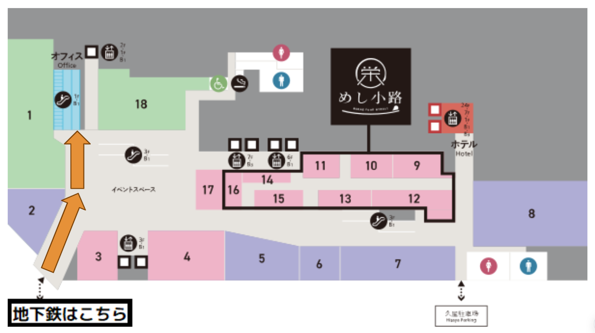
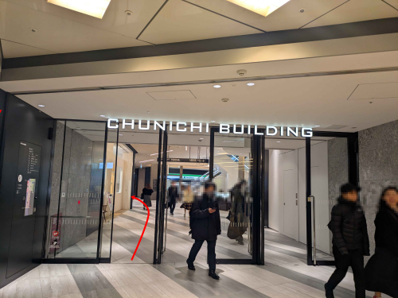
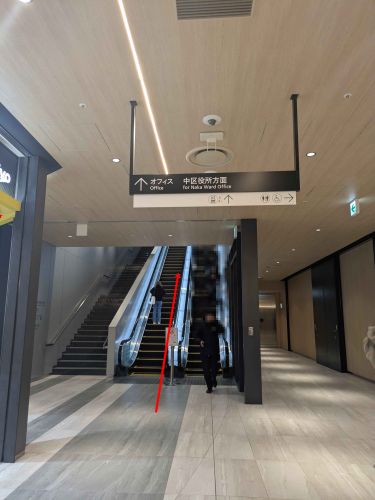
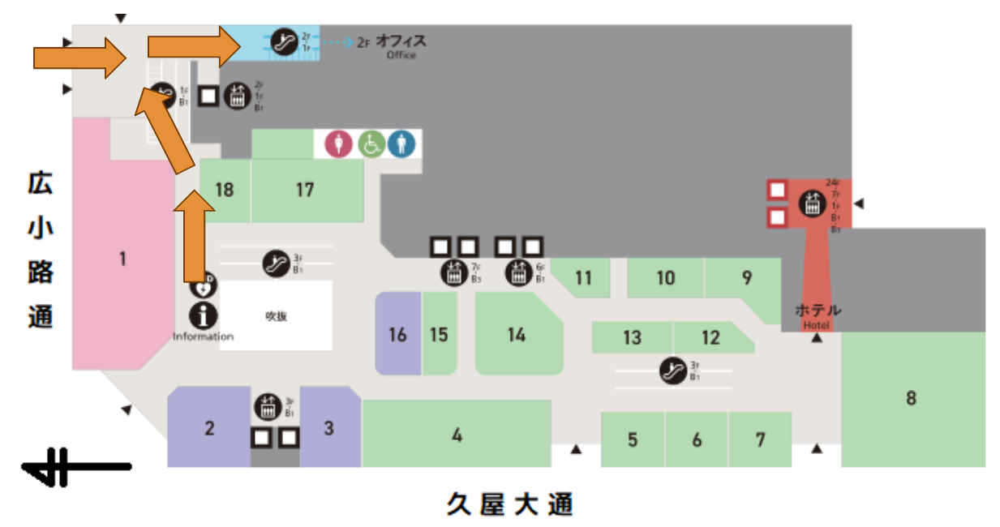
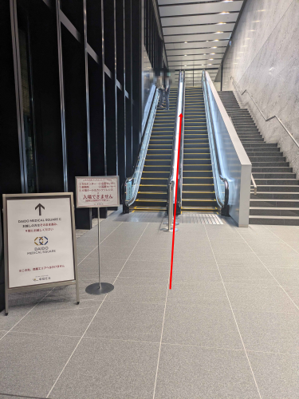
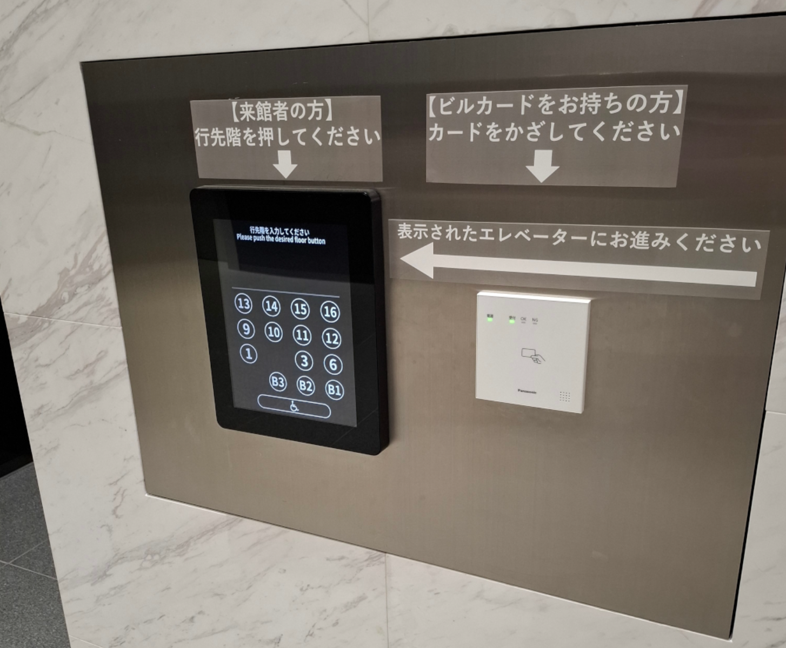
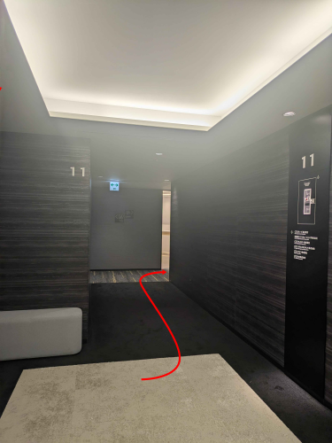

# NGK2025S 会場へのアクセス

## 所在地

伊藤忠テクノソリューションズ 名古屋オフィス

[中日ビル 11階](https://maps.app.goo.gl/hq1PWuo33Xz6JzzN6)（名古屋市中区栄4丁目1-1）

## アクセス方法

今回の会場は、中日ビルのオフィスエリアにあります。

中日ビルは地下鉄東山線・名城線「栄」駅、名鉄瀬戸線「栄町」駅より地下街で直結しています。

中日ビルには商業施設のエリアもありますが、今回の会場はオフィスエリアとなるため

まずはオフィスエリア入口となる2階オフィスエリアのエレベーターロビーへ向かっていただく必要があります。

### 地下街からいらっしゃる場合（地下1階から2階オフィスエリアのエレベーターロビーへ）

左前にオフィスエリアへ向かうエスカレーター・エレベーターがありますので、そちらでまずは2階に向かってください。

### 地上からいらっしゃる場合（1階から2階オフィスエリアのエレベーターロビーへ）

広小路通側にオフィスエリアへの入口がありますので、そこからエスカレーター・エレベーターでまずは2階に向かってください。

### 2階オフィスエリアのエレベーターロビーから会場まで

ここからオフィスの各階に行けますので、11階に向かってください。

ただしその際にエレベーターの行き先を、エレベーターに乗る前のボタンで指定する必要があります。

下図のパネルがエレベーターが並んでいる場所の手前にあるため、そこで11階を押すとエレベーターが来ます。

11階エレベーターホールの看板を見て左手に進んでください。

